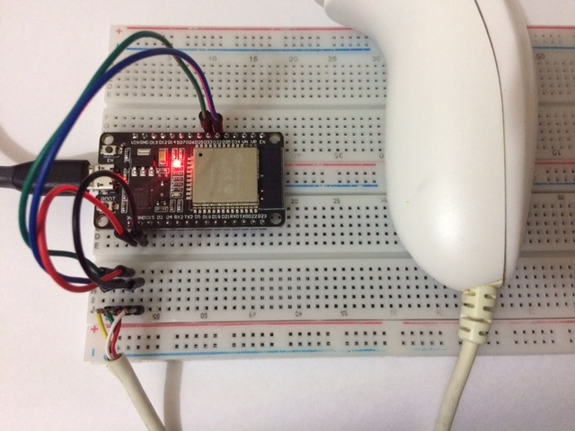

# esp32-wii-nunchuk

This is a library to use the Wii Nunchuk with the ESP32 via I2C.  It
uses the [ESP-IDF I2C
API](https://docs.espressif.com/projects/esp-idf/en/latest/esp32/api-reference/peripherals/i2c.html)
because the [Arduino Wire
library](https://www.arduino.cc/en/reference/wire) doesn't work
reliably in the ESP32 with Wii controllers.



This library supports the **Wii Nunchuk** and the **Wii Classic
Controller**.  It shouldn't be hard to adapt it to work with other I2C
devices that plug in the Wiimote (like the Classic Controller Pro, Wii
Motion Plus, etc.) with the information available in the [Wiibrew
project](http://wiibrew.org/wiki/Wiimote/Extension_Controllers), but I
have none of these devices so I don't know for sure.

To use the library in your Arduino IDE sketch, just copy the files
`wii_i2c.c` and `wii_i2c.h` to your sketch directory.

### Example Code

Example code for Nunchuk use (for a more complete example with
controller type detection, see `esp32-wii-nunchuk.ino`):

```C++
#include "wii_i2c.h"

// pins connected to the Nunchuk:
#define PIN_SDA      32
#define PIN_SCL      33

// ESP32 I2C port (0 or 1)
#define WII_I2C_PORT 0

void setup()
{
  Serial.begin(115200);

  if (wii_i2c_init(WII_I2C_PORT, PIN_SDA, PIN_SCL) != 0) {
    Serial.printf("Error initializing nunchuk :(");
    return;
  }
  wii_i2c_request_state();
}

void loop()
{
  const unsigned char *data = wii_i2c_read_state();
  wii_i2c_request_state();
  if (! data) {
    Serial.printf("no data available :(")
  } else {
    wii_i2c_nunchuk_state state;
    wii_i2c_decode_nunchuk(data, &state);
    Serial.printf("Stick position: (%d,%d)\n", state.x, state.y);
    Serial.printf("C button is %s\n", (state.c) ? "pressed" : "not pressed");
    Serial.printf("Z button is %s\n", (state.z) ? "pressed" : "not pressed");
  }
  delay(1000);
}
```
